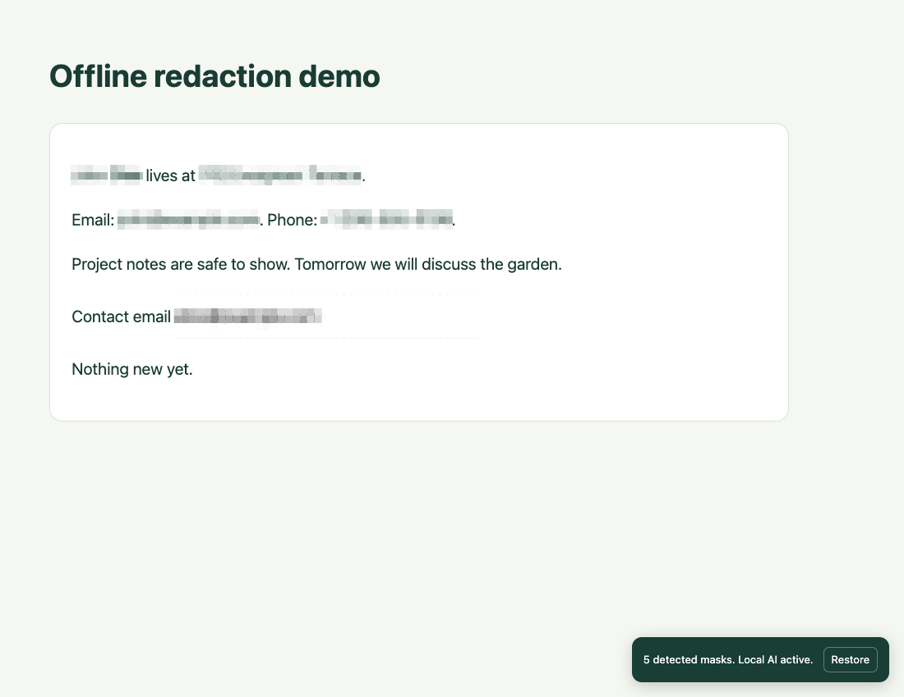

# GLiNvisible

**Personal information disappears. Your data stays on your computer.**

An open-source Chrome extension that mosaics visible personal information when you press a shortcut. GLiNER2-PII runs inside the extension through ONNX Runtime Web. No account, API key, cloud inference, or local server is required.



This is an early working prototype. Functional offline checks are included. Detection accuracy across websites and languages still needs evaluation.

## Try it

Requires desktop Chrome 116 or later and Node.js 22 or later to build.

```sh
git clone https://github.com/jheitzeb/glinvisible.git
cd glinvisible
npm ci
npm run build
```

1. Open `chrome://extensions`, enable **Developer mode**, and choose **Load unpacked**. Select the repository's `dist` folder.
2. Open GLiNvisible's setup page. Download the local model, about **551 MB**, or import the verified model folder. Keep setup open until installation finishes.
3. Run **Check offline readiness**. It loads the cached weights and checks a synthetic name and email with remote fetch blocked in the inference worker.
4. Open a webpage. Press **Command+Shift+Y** on Mac or **Ctrl+Shift+Y** on Windows/Linux to toggle mosaics. The toolbar popup also has redact, restore, and mask-selection actions. Change the shortcut at `chrome://extensions/shortcuts`.
5. Once the model is installed, turn off Wi-Fi. Redaction works on already loaded pages, including saved HTML files. For saved files, enable **Allow access to file URLs** in the extension's Chrome details page.

Chrome's own pages, the Chrome Web Store, and other protected pages cannot be injected. The extension works on page content, not browser chrome.

## Fully offline setup

Download the extension and model on an online computer, then transfer them to the offline computer:

```sh
npm run models:download
npm run package
```

The model folder is `artifacts/models/gliner2-pii-q8`. Setup's folder picker imports it without network access, checks each file's SHA-256 and size, and writes a readiness marker only after all files pass. Model files are stored in the extension's private Origin Private File System for the current Chrome profile. No model weights are committed or included in the extension zip.

The model download is the only application network path. All inference code, tokenizer code, JavaScript, and WASM ship in `dist`. The dedicated inference worker rejects remote fetches. Nothing scans automatically on installation. The shortcut grants access to the active tab. No browsing history, telemetry, or page content is uploaded.

## What gets masked

The first model adapter uses a pinned Q8 export of [Fastino's GLiNER2 privacy model](https://huggingface.co/fastino/gliner2-privacy-filter-PII-multi) from [okasi's ONNX export](https://huggingface.co/okasi/gliner2-privacy-filter-pii-multi-onnx). The export has seven fixed categories: names, addresses, emails, phone numbers, identifiers, URLs, and usernames. Names, addresses, emails, phone numbers, and identifiers are enabled by default. Local patterns also cover common email/phone formats, US SSNs, and recognizable API keys. Preferences include categories, threshold, block size, avatar hiding, and literal custom terms.

Text is collected from visible DOM nodes, open shadow roots, and visible form fields. Inline text across elements keeps its character offsets. Long text is processed in overlapping chunks. Detected character spans become DOM Range rectangles covered by opaque mosaic tiles. The page is covered while an initial or changed viewport is being scanned. Scroll, resize, typing, and DOM mutations trigger rescans; repeated text uses an in-memory cache. Restore removes the overlay.

Embedded iframes, canvases, and videos are covered as whole regions because this version cannot read their pixels. Images and closed shadow roots are not analyzed. Mask selected text manually when needed. The model card lists English, French, Spanish, German, Italian, Portuguese, and Dutch; language quality has not been validated here.

**Visual redaction is for screenshots, demos, and screen sharing.** Original text remains in the page DOM and can still be copied, inspected, saved, or read by assistive technology. This does not produce a sanitized document. Models can miss PII; review the result before sharing. Busy animated pages can keep the scan curtain up. CPU inference and the first model load can be slow, and this model requires substantial browser memory.

## Swapping models

The page scanner and mosaic renderer have no GLiNER dependency. `Detector` in `src/types.ts` defines three methods:

```ts
load(): Promise<void>;
detect(text: string, threshold: number): Promise<Span[]>;
dispose(): Promise<void>;
```

Every detector returns UTF-16 character spans and normalized categories. Add a pinned manifest entry in `src/models/catalog.ts`, implement an adapter, and register its factory in `src/models/registry.ts`. Setup and inference select the model ID from preferences. Model-specific tokenization, label schemas, output tensor shapes, and decoding belong in the adapter. Assets must use the same verified local installation path and must not fetch during inference. Swapping a compatible GLiNER2 export still requires matching its embedded label schema.

Architecture:

```text
Shortcut / popup -> background -> content scanner -> text segments
                                 offscreen document -> dedicated worker
                                                        model registry
                                                        Detector adapter
                                                        local OPFS assets
Content scanner <- UTF-16 spans <- worker
       |
Opaque mosaic overlay, no source DOM edits
```

## Development and checks

```sh
npm run check
npm test
npm run build
npm run models:download
npx playwright install chromium
npm run test:browser
npm run package
```

Contract tests cover Unicode offsets, chunk boundaries, half-precision tensors, span decoding, manual terms, and optional real-tokenizer parity against the pinned reference. Browser smoke checks use an isolated Chrome profile, import real model files, restart the browser, disable networking, scan saved HTML, rescan dynamic content, restore the page, and record attempted remote requests. They do not establish detection accuracy. The headless harness adds a test-only local-file host permission to stand in for access granted by a real toolbar click or native shortcut; that permission is absent from the shipped extension. Native shortcut testing remains manual. Generated models, profiles, evidence, and packages stay in ignored `artifacts/`.

`CHROMIUM_PATH=/absolute/path/to/Chromium` can select an existing Chromium binary. Use a Chromium build that supports unpacked extensions; branded Chrome has additional automation restrictions.

## License

Application code is MIT. Model weights and GLiNER2 components are Apache-2.0, downloaded separately. See [NOTICE](NOTICE) for model provenance and third-party licenses. GLiNvisible is an independent project and is not endorsed by Fastino or the ONNX export author.
